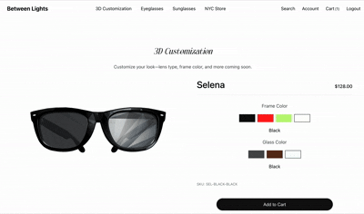

# Between Lights

> A full-stack eyewear e-commerce application with real-time 3D product customization, Stripe checkout, inventory tracking, and role-based admin tooling.

[](https://react.dev/)
[](https://vitejs.dev/)
[](https://redux-toolkit.js.org/)
[](https://expressjs.com/)
[](https://www.postgresql.org/)
[](https://stripe.com/)

---

## Project Overview

**Between Lights** is a portfolio-grade e-commerce experience for a premium eyewear brand. The application lets shoppers browse eyeglasses and sunglasses, customize a 3D frame model in the browser, manage a persistent cart, authenticate into an account, complete checkout via Stripe, and review order history. Admin users can access a protected dashboard backed by inventory APIs.

The product is built as a **monorepo** with a React SPA (`frontend/`) and an Express API (`backend/`), connected to **PostgreSQL** for products, users, orders, checkout session items, and inventory movements.

**Target users**

- Shoppers browsing and purchasing eyewear
- Registered customers managing account details and orders
- Admins monitoring sold products and stock

**Core experience**

- Editorial landing page with hero media and category entry points
- Catalog pages with filtering, sorting, and variant-aware product cards
- Product detail pages with color swatches, accordion content, and add-to-cart
- Interactive 3D customization with live material updates and cart snapshot capture
- Slide-out cart drawer and full-page cart view
- Stripe-hosted checkout with webhook-driven order persistence
- Responsive layout from mobile through desktop, with a mobile hamburger navigation pattern

---

## Demo

### Landing Page


### 3D Customization



---

## Features

### Shopping & catalog

- Browse **eyeglasses** and **sunglasses** in responsive product grids
- **Filter** by color and shape via a slide-out panel (eyeglasses; sunglasses shares filter UI patterns)
- **Sort** by price (ascending / descending)
- **Product cards** support front/side image toggle, inline color swatches, and slug-based routing
- **Product detail** pages resolve variants from URL slugs, with accordion sections and add-to-cart feedback

### 3D customization

- Real-time **WebGL** rendering via `@react-three/fiber` and `@react-three/drei`
- GLB model loaded from `/public/model/test.glb`
- Frame and lens colors applied at the **material** level (`frame`, `glasses`, `black.001`)
- Custom products added to cart with a generated SKU, composite color label, and **canvas snapshot** preview (`preserveDrawingBuffer`)

### Cart & checkout

- Redux-backed cart with quantity merge and custom product metadata
- Cart available as a **global drawer** (NavBar) or **full page** (`/cart`, protected)
- Checkout builds Stripe line items from cart state, including custom `custom:selena:*` product IDs
- Success page at `/success` after Stripe redirect

### Authentication & account

- Email/password **registration** and **login** with bcrypt-hashed passwords (backend)
- **JWT** session tokens returned on login and stored in Redux + `redux-persist`
- Protected routes for `/account`, `/cart`, and `/admin`
- Account page loads order history from `GET /api/orders/me`

### Admin & inventory

- Role-based access (`user` | `admin`) enforced in JWT payload and `adminRequired` middleware
- Admin dashboard route with sold-products data fetching (`fetchSoldProducts` thunk)
- Checkout webhook persists orders, line items, **atomic stock decrements**, and `inventory_movements` records

### Store & brand

- NYC showroom page with location copy and map image
- Shared **NavBar** with scroll/hover theming on the landing page and fixed light nav elsewhere
- Site-wide **Footer** with brand and location details

---

## Tech Stack

| Category               | Technologies                                                                                |
| ---------------------- | ------------------------------------------------------------------------------------------- |
| **Frontend**           | React 19, Vite 7                                                                            |
| **3D**                 | `@react-three/fiber`, `@react-three/drei`                                                   |
| **State**              | Redux Toolkit, `react-redux`, `redux-persist`                                               |
| **Routing**            | React Router v6 (`BrowserRouter`, nested route guards)                                      |
| **HTTP**               | Axios                                                                                       |
| **UI (selective)**     | Material UI (`@mui/material`) — dependency present; minimal direct usage                    |
| **Styling**            | Component-scoped CSS files, desktop-first responsive media queries, shared `responsive.css` |
| **Backend**            | Node.js, Express 5                                                                          |
| **Database**           | PostgreSQL via `pg` connection pool                                                         |
| **Auth**               | `jsonwebtoken`, `bcrypt`                                                                    |
| **Payments**           | Stripe Checkout + signed webhooks (`express.raw`)                                           |
| **Dev tooling**        | ESLint 9 (flat config), Prettier, Nodemon                                                   |
| **Package management** | npm (separate `frontend/` and `backend/` packages)                                          |
| **Deployment**         | _[Placeholder — not configured in repo]_                                                    |

---

## Architecture

### High-level data flow

```text
Browser (React SPA)
    │
    ├─ Redux store (persisted: products, cart, auth, favorites)
    │
    └─ Axios → Express API (/api/*)
                    │
                    ├─ PostgreSQL (products, users, orders, inventory)
                    └─ Stripe (checkout sessions + webhooks)
```

### Frontend structure

```text
frontend/src/
├── common/          # Shared UI: NavBar, Footer, ProductCard, AccountForm
├── pages/           # Route-level views
├── routes/          # Auth guards: ProtectedRoute, PublicOnlyRoute, AdminRoute
├── redux/           # Slices + persisted store configuration
├── styles/          # Per-page/component CSS + responsive helpers
└── utils/           # Pure helpers (slugify, product grouping, filters)
```

### Component strategy

- **Pages** own data fetching orchestration and layout composition
- **Common components** encapsulate repeated UI (navigation, product cards, forms)
- **Route guards** centralize auth and admin authorization logic
- **CSS colocation** by feature (`styles/ProductPage.css`, `styles/CartPage.css`, etc.) keeps styling maintainable without a heavy CSS-in-JS layer

### State management

| Slice       | Responsibility                          | Persisted |
| ----------- | --------------------------------------- | --------- |
| `products`  | Eyeglasses/sunglasses catalog           | Yes       |
| `cart`      | Line items, quantities, custom metadata | Yes       |
| `auth`      | User, JWT, login status                 | Yes       |
| `favorites` | Favorite product IDs                    | Yes       |
| `admin`     | Sold products admin data                | No        |

`redux-persist` includes a **migration** to invalidate stale auth state when a token is missing.

### Routing

| Route                        | Access      | Page               |
| ---------------------------- | ----------- | ------------------ |
| `/`                          | Public      | Landing            |
| `/eyeglasses`, `/sunglasses` | Public      | Catalog            |
| `/customization`             | Public      | 3D customizer      |
| `/nyc-store`                 | Public      | Store location     |
| `/:category/product/:slug`   | Public      | Product detail     |
| `/checkout`, `/success`      | Public      | Checkout flow      |
| `/login`, `/register`        | Public-only | Auth               |
| `/account`, `/cart`          | Protected   | Account, full cart |
| `/admin`                     | Admin       | Admin dashboard    |

NavBar `variant` switches between transparent (landing) and solid (inner pages) based on `useLocation()`.

### Backend structure

```text
backend/src/
├── index.js              # Express app, CORS, webhook raw body, route mounting
├── db/index.js           # PostgreSQL pool
├── middleware/auth.js    # authRequired, optionalAuth, adminRequired
└── routes/
    ├── auth.js           # Register, login (JWT)
    ├── products.js       # Catalog with image aggregation
    ├── orders.js         # Authenticated order history
    ├── stripe.js         # Checkout session creation + session item persistence
    ├── stripeWebhook.js  # Order + inventory side effects
    └── admin.js          # Sold products summary/details
```

### Styling architecture

- **Desktop-first** base styles preserve the original 1280px+ layout
- **Breakpoint overrides** at 1279px, 1024px, 767px, and 480px
- Shared `styles/responsive.css` for global `box-sizing`, overflow control, and image safety
- Cart and filter panels reuse the same drawer CSS patterns (`.cart_overlay`, `.cart_container`)

---

## Key Technical Highlights

### Reusable product modeling

`groupProductsByStyle()` groups flat API product rows into style families with color variants — powering catalog cards, product pages, cart resolution, and checkout line-item building.

### Slug-based product routing

URL slugs (`name-color`) are generated with `slugify()` and matched against grouped variants, enabling shareable product URLs without extra API round-trips.

### Custom product pipeline

Custom items use deterministic IDs (`custom:selena:<frame>:<glass>`), bypass UUID validation server-side, and store `product_id = null` in checkout session items while still appearing in Stripe and the cart UI.

### Checkout integrity

1. Client sends validated line items to `POST /api/stripe/create-checkout-session`
2. Server stores rows in `checkout_session_items`
3. Stripe webhook reads saved items (not Stripe line items alone) to write `order_items`
4. Stock updates run in a **transaction** with rollback on insufficient inventory

### Cart dual layout

`CartPage` supports `layout="drawer"` (NavBar overlay) and `layout="page"` (protected full-page view) from a single component.

### Responsive navigation

Desktop retains the original multi-column inline nav. At ≤767px, a **hamburger menu** opens a left slide-out panel; cart remains accessible in the top bar. Menu state closes on route change, backdrop click, and Escape.

### Performance-oriented patterns (implemented)

- `useMemo` for filtered/sorted catalog rows, cart variant lookups, and checkout totals
- `React.useMemo` for cloning the 3D GLB scene to avoid mutating the cached asset
- Redux persist to reduce repeat catalog fetches across sessions
- CSS transitions for drawer/modal animations (no heavy animation libraries)

### Not implemented (intentionally omitted from claims)

- Route-level `React.lazy` / code splitting
- `React.memo` on list items
- Framer Motion or a dedicated animation library
- Dedicated custom hooks directory (`ScrollToTop` lives in `utils/utils.jsx`)

---

## Libraries & Tools

| Library                   | Role in this project                                                           |
| ------------------------- | ------------------------------------------------------------------------------ |
| **React 19**              | Component model, hooks, concurrent-ready UI                                    |
| **Vite**                  | Fast dev server, HMR, production bundling                                      |
| **Redux Toolkit**         | Slices, async thunks (`loginUser`, `fetchSoldProducts`), boilerplate reduction |
| **redux-persist**         | Survives refresh for cart, auth, and catalog cache                             |
| **React Router v6**       | Declarative routing, nested outlets, redirects in route guards                 |
| **Axios**                 | Auth, checkout, orders, and admin API calls                                    |
| **@react-three/fiber**    | React renderer for the customization Canvas                                    |
| **@react-three/drei**     | `useGLTF`, `OrbitControls`, `Environment` for 3D scene setup                   |
| **Express**               | REST API, static `/public` serving, Stripe webhook raw body handling           |
| **pg**                    | Parameterized SQL for products, orders, inventory                              |
| **Stripe**                | Hosted checkout, webhook-verified payment completion                           |
| **bcrypt / jsonwebtoken** | Password hashing and stateless API auth                                        |
| **ESLint + Prettier**     | Linting and formatting in the frontend workspace                               |

---

## Responsive Design

The UI uses a **desktop-first** strategy: base CSS matches the original desktop layout; smaller viewports receive `max-width` overrides only.

| Breakpoint  | Typical behavior                                                                                                |
| ----------- | --------------------------------------------------------------------------------------------------------------- |
| **1280px+** | Source-of-truth desktop layout                                                                                  |
| **≤1279px** | Reduced horizontal padding on catalog, cart, customization                                                      |
| **≤1024px** | Landing sections stack; product page becomes single column; NYC store stacks text/map; catalog grid → 3 columns |
| **≤767px**  | Hamburger nav; 2-column product grid; full-width cart/filter drawers; stacked account layout                    |
| **≤480px**  | Single-column catalog grid; tighter form and checkout padding                                                   |

Techniques: CSS Grid/Flexbox, `clamp()`, `min()`, `aspect-ratio`, `width: 100%` (replacing `100vw` where overflow occurred), and touch targets ≥44px on mobile controls.

---

## Performance

| Optimization                       | Where                                                      |
| ---------------------------------- | ---------------------------------------------------------- |
| Memoized derived data              | Catalog filter/sort, `ProductPage`, `CartPage`, `Checkout` |
| Cloned 3D scene graph              | `Customization.jsx` — avoids mutating `useGLTF` cache      |
| Persisted Redux slices             | Fewer repeat fetches; instant cart restore                 |
| Image `object-fit` + aspect ratios | `ProductCard`, landing sections                            |
| Drawer CSS transitions             | GPU-friendly `transform` animations                        |

**Opportunities not yet implemented:** route-based code splitting, image CDN/lazy loading, API base URL consistency in `productsSlice` (currently hardcoded to `localhost:5000` in thunks).

---

## Accessibility

Implemented patterns (partial — not a full WCAG audit):

- Semantic landmarks: `<header>`, `<nav aria-label>`, `<footer>`
- Mobile menu: `aria-expanded`, `aria-controls`, `aria-label`, Escape to close
- Cart/filter: labeled close buttons and backdrop controls
- Sort menu: `aria-haspopup`, `role="listbox"`, `role="option"`
- Checkout/account errors: `role="alert"`
- Color swatches and qty buttons: descriptive `aria-label`s
- Mobile touch targets on cart, menu, and filter actions

**Not claimed:** full keyboard focus trap in drawers, WCAG 2.2 AA certification, or automated a11y testing.

---

## Getting Started

### Prerequisites

- **Node.js** 18+ (20+ recommended)
- **npm**
- **PostgreSQL** database with schema for users, products, product_images, orders, order_items, checkout_session_items, inventory_movements
- **Stripe** account (test mode) + Stripe CLI for local webhooks

### Installation

```bash
# Clone the repository
git clone <your-repo-url>
cd my-ecommerce

# Frontend
cd frontend
npm install

# Backend (separate terminal)
cd ../backend
npm install
```

### Environment variables

**`frontend/.env`**

```env
VITE_API_BASE_URL=http://localhost:5000
```

**`backend/.env`** _(create from your local setup)_

```env
PORT=5000
JWT_SECRET=your_jwt_secret

DB_USER=your_db_user
DB_HOST=localhost
DB_NAME=your_db_name
DB_PASSWORD=your_db_password
DB_PORT=5432

STRIPE_SECRET_KEY=sk_test_...
STRIPE_WEBHOOK_SECRET=whsec_...
FRONTEND_URL=http://localhost:5173
```

> **Note:** Database migration files are not included in the repository. Schema setup is a manual prerequisite.

### Running locally

**Terminal 1 — API**

```bash
cd backend
npm run dev
# → http://localhost:5000
```

**Terminal 2 — Frontend**

```bash
cd frontend
npm run dev
# → http://localhost:5173 (default Vite port)
```

**Terminal 3 — Stripe webhooks (for order persistence)**

```bash
stripe listen --forward-to localhost:5000/api/stripe/webhook
```

### Frontend scripts (`frontend/package.json`)

| Command           | Description                      |
| ----------------- | -------------------------------- |
| `npm run dev`     | Start Vite dev server            |
| `npm run build`   | Production build to `dist/`      |
| `npm run preview` | Preview production build locally |
| `npm run lint`    | Run ESLint                       |
| `npm run format`  | Format with Prettier             |

### Backend scripts (`backend/package.json`)

| Command       | Description            |
| ------------- | ---------------------- |
| `npm run dev` | Start API with Nodemon |

---

## Folder Structure

```text
my-ecommerce/
├── frontend/
│   ├── public/                 # Static assets (landing images, GLB model, account image)
│   ├── src/
│   │   ├── common/             # NavBar, Footer, ProductCard, AccountForm
│   │   ├── pages/              # Route views (Landing, Catalog, Customization, Checkout, …)
│   │   ├── routes/             # ProtectedRoute, PublicOnlyRoute, AdminRoute
│   │   ├── redux/              # Store, slices, persist config
│   │   ├── styles/             # Feature CSS + responsive.css
│   │   ├── utils/              # slugify, grouping, filter helpers, ScrollToTop
│   │   ├── App.jsx             # Routes + layout shell
│   │   └── main.jsx            # Provider, PersistGate, Router bootstrap
│   ├── eslint.config.js
│   ├── vite.config.js
│   └── package.json
│
└── backend/
    ├── public/                 # Server-static files (if used)
    ├── src/
    │   ├── db/                 # PostgreSQL pool
    │   ├── middleware/         # JWT auth middleware
    │   ├── routes/             # REST + Stripe webhook handlers
    │   └── index.js            # Express entry point
    └── package.json
```

---

## Future Improvements

- [ ] **Search page** — NavBar links to `/search`, but no route is registered yet
- [ ] **Favorites UI** — Redux slice exists; account page shows placeholder copy only
- [ ] **Admin dashboard UI** — Expand sold-products table, stock alerts, and admin nav link
- [ ] **Pre-checkout stock validation** — Reject checkout session creation when `stock_units` is insufficient
- [ ] **Centralize API base URL** — Use `VITE_API_BASE_URL` in `productsSlice` thunks
- [ ] **Route-level code splitting** — `React.lazy` for 3D customization and admin routes
- [ ] **Database migrations** — Versioned SQL or migration tool in repo
- [ ] **Deployment** — Vercel/Netlify (frontend) + Render/Railway/Fly (backend) with env docs
- [ ] **E2E tests** — Playwright for checkout and auth flows
- [ ] **Clear admin state on logout** — Wire `clearAdminData` in auth logout flow

---

## Engineering Takeaways

This project demonstrates end-to-end ownership of a modern commerce flow — not just UI polish, but the integration points that make a storefront real.

**Frontend engineering**

- Scalable folder separation (pages, common, routes, redux, styles)
- Redux Toolkit with persistence and guarded routes
- Complex UI patterns: slide-out cart, filter drawer, mobile hamburger nav, accordion PDP
- Desktop-first responsive CSS without redesigning the original layout
- WebGL integration with material-level customization and cart snapshot export

**Full-stack thinking**

- JWT auth with role-based admin middleware
- Stripe Checkout + webhook-driven order and inventory side effects
- Transactional stock updates with rollback on failure
- Custom product IDs handled consistently across client, checkout API, and webhook

**Maintainability**

- Pure utility functions for slug, grouping, and filtering logic
- Reused CSS patterns across cart and filter drawers
- Clear separation between catalog presentation and API product shape

Between Lights reads as a **production-minded portfolio piece**: a shopper-facing brand experience backed by deliberate state management, payment integration, and inventory-aware order processing.

---

## Author

Carmine Yijin Ro — [Portfolio](www.carmcodes.com) · [LinkedIn](linkedin.com/in/carminero0921) · [Email](yri.carmine@gmail.com)\_
